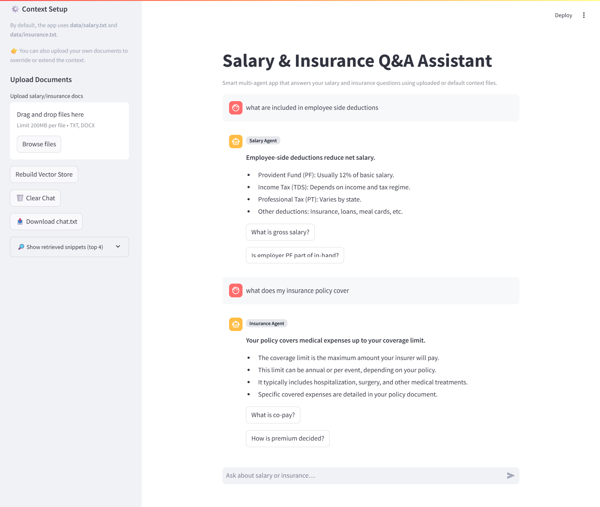

# Salary & Insurance Q&A Assistant  

A smart multi-agent RAG app built with **Streamlit + LangChain + Gemini AI**.  
It answers salary and insurance questions clearly using default or uploaded context files.  

---

## Live Demo  

👉 [Try the app here](https://multiagent-rag.streamlit.app/)  

---

## Features  

- **Salary Q&A**: Gross vs in-hand, CTC breakdown, deductions  
- **Insurance Q&A**: Coverage, premiums, claims, co-pay  
- **Multi-Agent Routing**: Queries sent to the right specialist  
- **Custom Context**: Use default docs or upload your own  
- **Download Chat**: Export conversations as text  
- **Follow-up Suggestions**: Quick one-click related questions  
- **Debug Mode**: View retrieved snippets  

---

## User Experience  

- Clean chat interface with role labels  
- Clear answers: **bold summary + bullet points**  
- Sidebar for setup, uploads, downloads  

---

## Tech Stack  

- Python, Streamlit  
- LangChain for orchestration  
- Gemini AI for LLM responses  
- FAISS for vector search  

---

## Demo & Screenshots  

  
